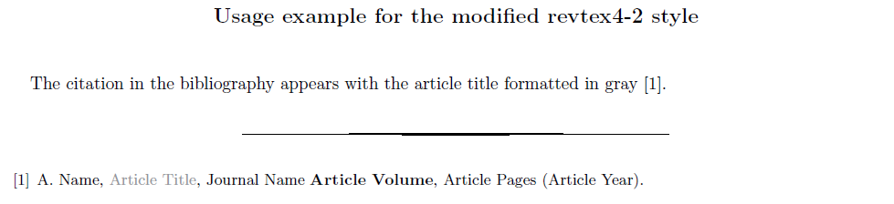

# License information
The bibtex style file (.bst) in this repository has been derived from the original file `apsrev4-2.bst`, which is part of the revtex latex package obtainable at https://ctan.org/tex-archive/macros/latex/contrib/revtex and distributed under the LaTeX Project Public License. 

The file has been modified to include article titles in the bibliography by default, and to print them in gray color. 

# Usage
Include the `modified-apsrev4-2.bst` file in the main directory of your Latex project and specify it as the bibliography style with the Latex command `\bibliographystyle{apsrev4-2}`, see the example below. 
Compile with the usual commands
```
pdflatex example
bibtex example
pdflatex example
pdflatex example
```


#### example.tex:
```latex
\documentclass{revtex4-2}
\bibliographystyle{modified-apsrev4-2}

\usepackage[usenames,dvipsnames]{color}

\begin{document}

\title{Usage example for the modified revtex4-2 style}
\maketitle

The citation in the bibliography appears with the article title formatted in gray~\cite{ExampleCitation}.

\bibliography{example}

\end{document}
```

#### example.bib:
```
@article{ExampleCitation,
	author = {Author Name},
	journal = {Journal Name},
	pages = {Article Pages},
	title = {Article Title},
	volume = {Article Volume},
	year = {Article Year}
}
```

#### Compiled pdf output:
